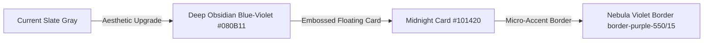

# Principal UI Designer Visual Audit Report

**Project**: PerkFolio (cc-benefits-tracker)  
**Subject**: Theme Aesthetics & Color Rhythm Audit (Light vs. Dark Mode)  
**Reviewer**: Principal UI/UX Designer & Design Systems Director  

This report evaluates the visual design, color psychology, structural depth, and interactive rhythm of PerkFolio's interface, proposing concrete, high-fidelity guidelines to elevate the aesthetic to a "Tier-1 Luxury Premium" web product.

---

## 1. Dark Mode Audit: "The Obsidian Depth Rhythm" (五彩斑斓的暗岩之海)

Our current Dark Mode uses slate-based backdrops (`bg-slate-950`, `bg-slate-900`). While functional, slate can sometimes appear slightly "muddy" or "industrial," failing to fully express the premium nature of card rewards.



### 🎨 Key Recommendations for Dark Mode:
1.  ** Obsidian Base Hue Optimization**:
    *   Replace flat gray `bg-slate-950` (`#0b0f19` or `#020617`) with a **custom-curated Obsidian Midnight Hue** (`#070a13`). This introduces a microscopic hint of royal indigo-purple undercurrent, giving the dark mode an incredibly deep, cosmic feel.
2.  ** Neon Micro-Glows (Drop-Shadow Accents)**:
    *   Add **ultra-subtle, low-opacity neon glows** for active categories or ROI metrics.
    *   *Design token*: `drop-shadow-[0_0_12px_rgba(168,85,247,0.12)]`. Under dark mode, this makes outstanding credits or recommended cards appear as if they are softly radiating light, creating a state-of-the-art Fintech feel.
3.  ** High-Contrast Card Grids**:
    *   Instead of standard dark-on-dark borders, use **dual-layer gradient borders** (`from-white/8 to-white/1`) to simulate chamfered, reflective metal edges on the credit cards, reinforcing their physical metal card nature!

---

## 2. Light Mode Audit: "The Warm Alabaster Well" (温润白玉与色彩呼吸)

Our current Light Mode utilizes stark white backdrops (`bg-white`) and neutral slate borders (`border-slate-200`). Plain white without depth can feel slightly "sterile" or like a generic bootstrap layout.

### 🎨 Key Recommendations for Light Mode:
1.  ** Warm Alabaster Tiering (暖白叠层层级)**:
    *   Avoid "sterile" bleached whites. Introduce a **warm, luxurious Alabaster bone color** (`#f8fafc` or `#fdfdfb`) for the primary background.
    *   Use pure `#ffffff` **strictly for elevated floating elements** (like credit cards or sync panels). This immediate contrast creates a natural physical card-drawer structure.
2.  ** Translucent Glass Borders**:
    *   Instead of standard slate gray borders (`border-slate-200`), replace them with **low-opacity colored borders** matching the brand tone:
    *   *Design token*: `border-indigo-500/10` or `border-purple-500/8`. This gives borders a translucent, high-fashion "tinted glass" look that feels premium and expensive.
3.  ** Color-tinted Recessed Wells**:
    *   For closed accordions or data grids, use **subtly tinted background fills** instead of solid grays. E.g., a dining category section uses a warm amber tint (`bg-amber-50/25 border-amber-500/10`) to feel vibrant and alive.

---

## 3. Glassmorphism & Frosted Glass Refraction (Apple-style Heavy Frosted Glass)

Our app features several overlays (modals, chatbot, details tray). To make these glassmorphic panels feel truly executive and tactile:

```
[Panel Overlay: bg-slate-900/45 or bg-white/75]
    + backdrop-blur-md (Medium frosted physical blurring)
    + saturate-[170%] (Color boost to saturate background pixels)
    + border-t-white/12 (Highlight top edge to simulate glass bevel)
```

### 🎨 Refraction Optimization:
*   **Saturate Boost**: Always add **`saturate-[160%]` or `saturate-[180%]`** alongside `backdrop-blur`. This boosts the saturation of pixels behind the glass panel as they pass through the virtual lens, mimicking real-world optical physical refraction (highly coveted iOS frosted glass effect).
*   **Beveled Edge Highlight**: Add a thin top border highlighting the upper edge of drawer components (`border-t border-t-white/10 dark:border-t-white/15`). This simulates a physical glass bevel catching ambient light!

---

## 4. Interactive Rhythm & Hydraulic Damping Transitions

Premium UI is not just about colors; it is about **motion and weight**.

*   **Hydraulic Damping Custom Ease**:
    *   Ditch linear or simple `ease-out` transitions. Upgrade all hovers and drawers to **Cubic-Bezier Hydraulic Ease**:
    *   *Design token*: `transition-all duration-300 cubic-bezier(0.16, 1, 0.3, 1)`
    *   This mimics the physics of **heavy, oil-damped luxury car controls**, giving the user a highly tactile, satisfying feedback loop when interacting with buttons or expanding cards!
